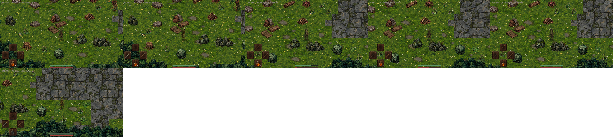

# Light Spirits

A top-down action RPG built with Pygame and the Gale engine. Inpired in Albion gameplay and Dark Souls-styled ruins and difficulty, an archer working through them, with the capability to use a sword and slide, building up to a two-phase boss.

Final project for ISPPV1 (Video Game Programming I), Universidad de Los Andes.

## Status

Milestone 6, the complete game. An archer with a bow and a sword, each with its own charged attack aimed at the mouse, a dodge roll with invulnerability frames, a shared stamina bar gating both, and four estus flasks to heal with. Three enemy kinds (zombie, witch, golem) guard the ruins, each with a single unpredictable charged attack and a stun that can chain if the player isn't careful. The final boss is fully playable: Samurai Gurenmaru, a relentless melee duelist, and the Light Spirit that rises from his body once he falls, a ranged archer that keeps its distance, ending the game once both are defeated. The ruins are now a hand-built map made in Tiled, with a procedural fallback kept for anything built without one. Silent while exploring, as in Dark Souls, with music only on the title screen and in the boss fight, and a sound for every hit and action. Runs borderless fullscreen with the mouse confined to the window. See `CHANGELOG.md` for progress by milestone.

## Running it

Python is interpreted, so there is nothing to compile: running the game is setting up an environment once, then launching `main.py`.

### Requirements

- **Python 3.12 or 3.13.** Python 3.14 does not work yet: some of `gale-engine`'s dependencies (Pygame, Box2D) publish no prebuilt packages for it, and pip fails trying to build them from source.
- **`gale-engine`**, the only dependency, declared in the repository root's `requirements.txt`. It brings Pygame and NumPy along with it.

### From a terminal

Once, from the **repository root** (one virtual environment is shared by every project in the repository):

```powershell
py -3.13 -m venv .venv
.venv\Scripts\activate          # macOS / Linux: source .venv/bin/activate
pip install -r requirements.txt
```

Then, every time, from **this folder**:

```powershell
cd 09-light_spirits
python main.py
```

The game has to be launched from its own folder, because `main.py` imports `settings` and `src` relative to it.

### From VS Code

The repository ships a `.vscode` folder that does all of the above for you:

- `.vscode/settings.json` points VS Code at the root `.venv`, so every new terminal activates it on its own and Pylance knows where Pygame and Gale are.
- `.vscode/launch.json` adds two ways to run with `F5`:
  - **Juego del archivo abierto**: `F5` from any file inside `09-light_spirits` runs this game (even pngs). It goes through `.vscode/run_current_game.py`, which walks up from the open file to the nearest `main.py`, moves into that folder, and runs it inside the same process, so breakpoints set anywhere in the game's code still stop.
  - **Elegir juego de la lista**: pick `09-light_spirits` from a list instead of depending on which file is open.

Without VS Code, the terminal steps above are all it takes; the `.vscode` folder is only a convenience.

### Rebuilding the art

Only needed after changing the source art: `python tools/build_assets.py`, from this folder. It reads the full-resolution originals in `assets/source/`, which are not part of the repository (see Assets below), so it only runs on the machine that has them.

## Controls

- `WASD` — move
- Mouse — aim
- Left click (hold) — charge the equipped weapon's attack, release to fire/swing
- `Space` — dodge roll, toward whatever movement key is held, or toward the mouse if none is
- `Q` — switch weapon (bow / sword)
- `R` — drink an estus flask (4 per run)
- `Enter` — confirm (title screen, game over)
- `F1` — toggle debug view (collision boxes, depth-sort lines)
- `F2` — teleport to the boss arena (debug, for testing the fight)

## Assets

All art is AI-generated, then packed by `tools/build_assets.py` into one tileset per category in `assets/tilesets/` (a PNG plus a JSON index naming every region), which both the game and Tiled load. The full-resolution originals live in `assets/source/`, kept out of the repository for their size, so the script only runs on the machine that has them. See that file's docstring for the conversion pipeline and why it works the way it does.

Audio lives in two folders: `assets/sounds` for short effects, loaded whole so any number can play at once, and `assets/music` for long tracks, streamed from disk one at a time. Both are played through `src/audio.py`.

## Map (Tiled)

The ruins are a map authored in Tiled (`assets/maps/ruins_v2.tmj`), painted with the same tilesets `tools/build_assets.py` produces, and loaded by `Level.try_load_tilemap` (see `src/world/tiled.py` for how). Only the `walls` tile layer blocks, and only on tiles marked `collision = solid` in Tiled's own tileset editor; every placed object becomes a prop, a piece of decor, an enemy, the boss, or the player's start, decided entirely by which tileset its sprite came from. If that file is ever missing, `Level` falls back to the original procedural generator, seed and all, so the game never fails to start without it.

## Screenshots

### Milestone 6



### Milestone 5


### Milestone 4


### Milestone 3


### Milestone 2


### Milestone 1


## Acknowledgements

- **To our professor Alejandro Mujica**, for everything the course gave us to learn from: the course website, laid out as a map of topics to work through one by one; the [base repository](https://github.com/R3mmurd/VideoGameProgrammingI) with its study cases and the Gale engine this game is built on; the 120-page book; and the online classes.
- **To my teammate [Juan Márquez](jhonpablomarquez@gmail.com)**, who took the first draft of the ruins and turned it into the finished map in Tiled, placing every prop, enemy and piece of decor in its layer.
- **To my girlfriend, [@paubee-ctrl](https://github.com/paubee-ctrl)**, who helped me find the tile assets and the sounds that give the ruins their atmosphere.
- **To Dark Souls**, and to FromSoftware, the inspiration behind all of it: the bonfires, the estus, the stamina, the unforgiving enemies and a boss that rises again when you think it's over. This game was made with a lot of love for the genre.
