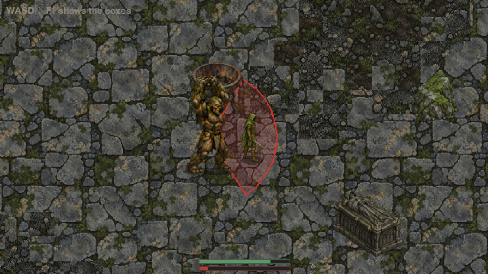
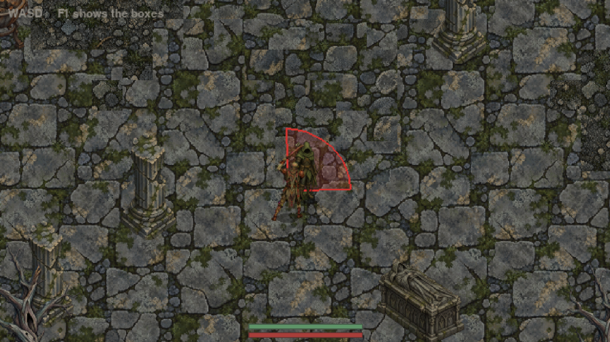
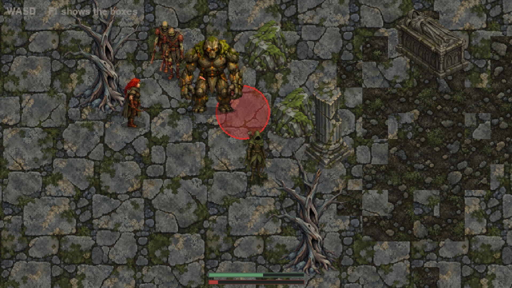
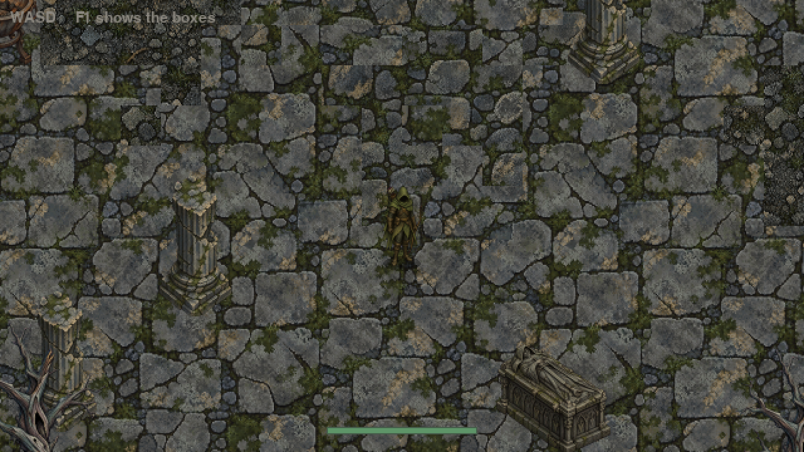
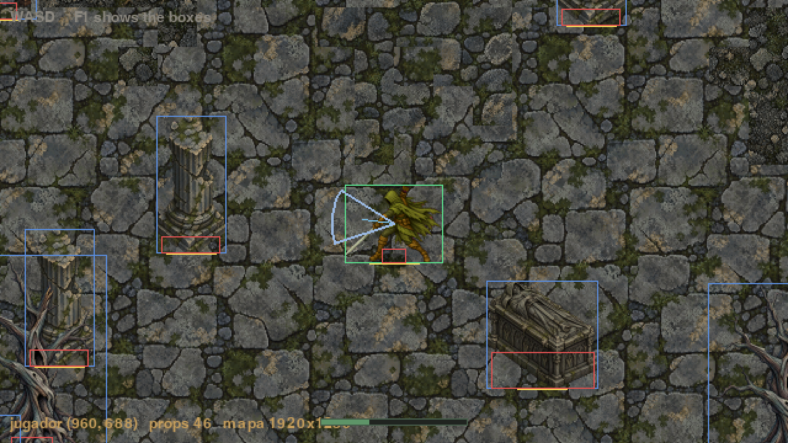
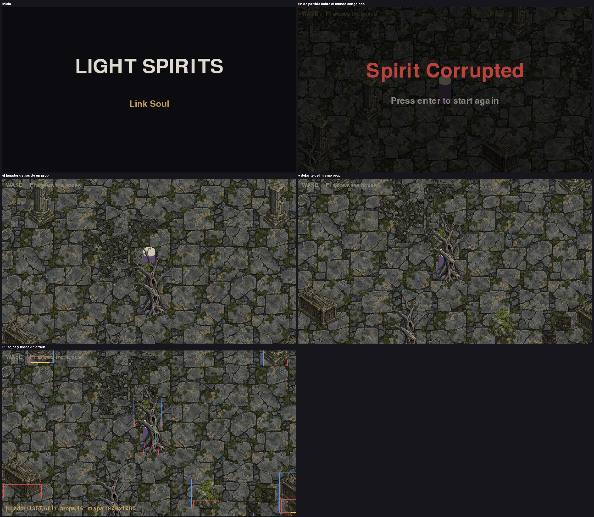

# Light Spirits

A top-down action RPG built with Pygame and the Gale engine. Inpired in Albion gameplay and Dark Souls-styled ruins and difficulty, an archer working through them, with the capability to use a sword and slide, building up to a two-phase boss.

Final project for ISPPV1 (Video Game Programming I), Universidad de Los Andes.

## Status

Milestone 5. An archer with a bow and a sword, each with its own charged attack aimed at the mouse, a dodge roll with invulnerability frames, and a shared stamina bar gating both. Three enemy kinds (zombie, witch, golem) guard the ruins, each with a single unpredictable charged attack and a stun that can chain if the player isn't careful. The final boss is fully playable: Samurai Gurenmaru, a relentless melee duelist, and the Light Spirit that rises from his body once he falls, a ranged archer that keeps its distance, ending the game once both are defeated. The ruins are now a hand-built map made in Tiled, with a procedural fallback kept for anything built without one. Runs borderless fullscreen with the mouse confined to the window. See `CHANGELOG.md` for progress by milestone.

## Running it

From this folder:

```
python main.py
```

Requires `gale-engine` (see the repo root's `requirements.txt`). `numpy` is also needed, both to run `tools/build_assets.py` and to draw the title screen's vignette.

## Controls

- `WASD` — move
- Mouse — aim
- Left click (hold) — charge the equipped weapon's attack, release to fire/swing
- `Space` — dodge roll, toward whatever movement key is held, or toward the mouse if none is
- `Q` — switch weapon (bow / sword)
- `Enter` — confirm (title screen, game over)
- `F1` — toggle debug view (collision boxes, depth-sort lines)
- `F2` — teleport to the boss arena (debug, for testing the fight)

## Assets

All art is AI-generated, then packed by `tools/build_assets.py` into one tileset per category in `assets/tilesets/` (a PNG plus a JSON index naming every region), which both the game and Tiled load. The full-resolution originals live in `assets/source/`, kept out of the repository for their size, so the script only runs on the machine that has them. See that file's docstring for the conversion pipeline and why it works the way it does.

## Map (Tiled)

The ruins are a map authored in Tiled (`assets/maps/ruins_v2.tmj`), painted with the same tilesets `tools/build_assets.py` produces, and loaded by `Level.try_load_tilemap` (see `src/world/tiled.py` for how). Only the `walls` tile layer blocks, and only on tiles marked `collision = solid` in Tiled's own tileset editor; every placed object becomes a prop, a piece of decor, an enemy, the boss, or the player's start, decided entirely by which tileset its sprite came from. If that file is ever missing, `Level` falls back to the original procedural generator, seed and all, so the game never fails to start without it.

## Screenshots

### Milestone 5


### Milestone 4


### Milestone 3





### Milestone 2




### Milestone 1


